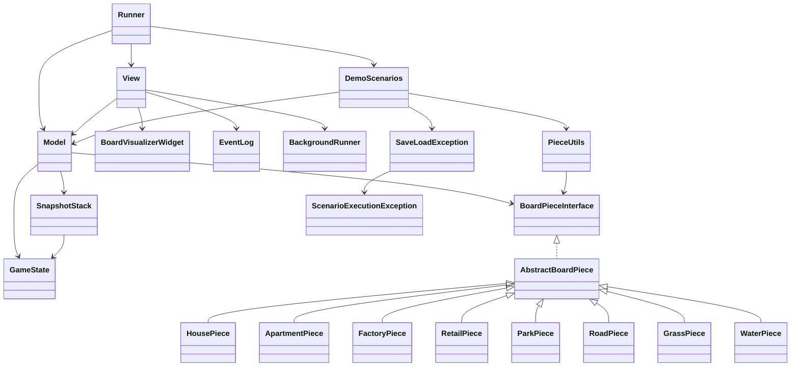

# Class Diagram (UML)

```mermaid

classDiagram

Runner --> Model
Runner --> View
Runner --> DemoScenarios

View --> BoardVisualizerWidget
View --> Model
View --> EventLog
View --> BackgroundRunner

Model --> BoardPieceInterface
Model --> GameState
Model --> SnapshotStack

SnapshotStack --> GameState

BoardPieceInterface <|.. AbstractBoardPiece

AbstractBoardPiece <|-- HousePiece
AbstractBoardPiece <|-- ApartmentPiece
AbstractBoardPiece <|-- FactoryPiece
AbstractBoardPiece <|-- RetailPiece
AbstractBoardPiece <|-- ParkPiece
AbstractBoardPiece <|-- RoadPiece
AbstractBoardPiece <|-- GrassPiece
AbstractBoardPiece <|-- WaterPiece

PieceUtils --> BoardPieceInterface

DemoScenarios --> Model
DemoScenarios --> PieceUtils
DemoScenarios --> SaveLoadException

SaveLoadException --> ScenarioExecutionException
```

